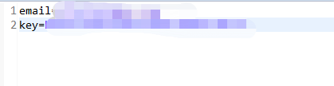
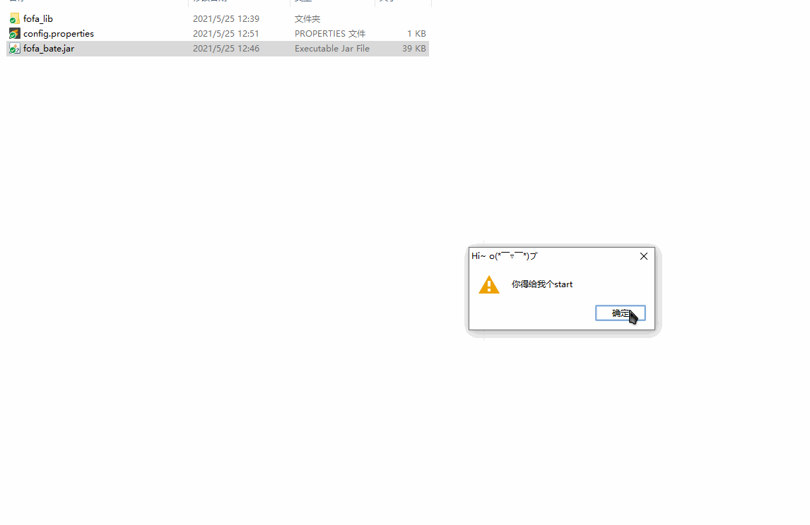
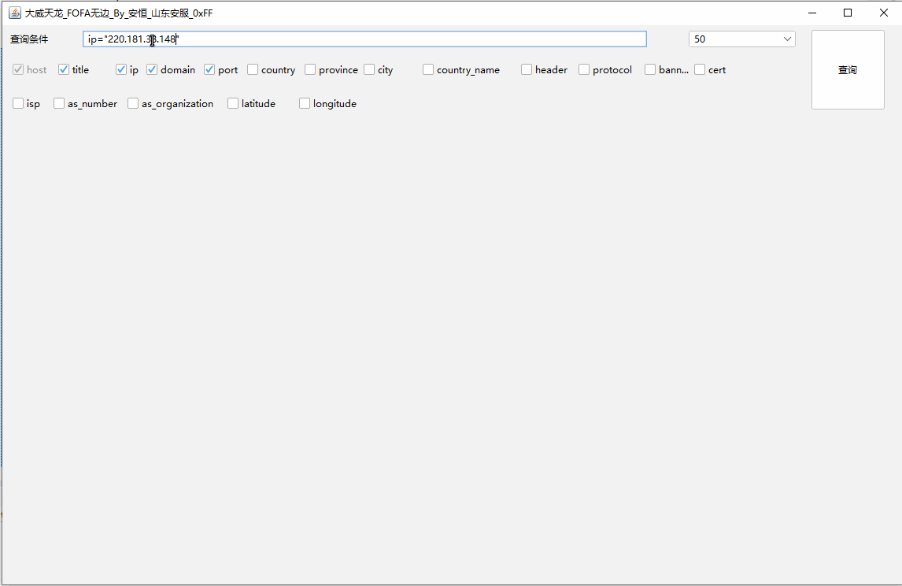
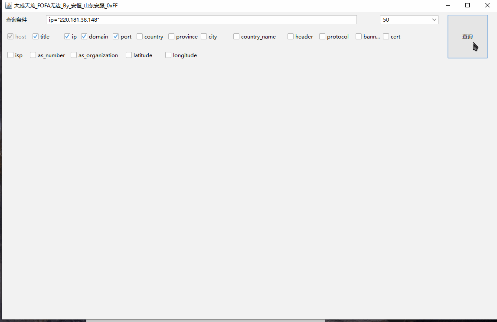
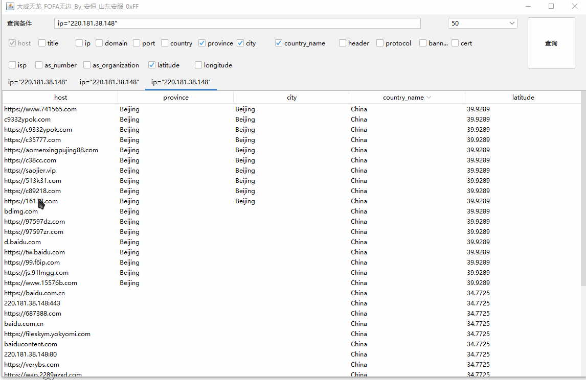

# 大威天龙_fofa无边

## 使用说明:

该jar文件同目录下创建config.properties文件

文件中添加

email=123123@11.com

key=asfasfadsf

目录结构如下:

运行如下

输入网查询条件直接回车即可进行查询

## 特点如下:

* 根据官方API进行编写

* 多Tab,每次查询都会生成一个tab页面,对历史查询内容进行暂存,方便对比

* 

* 对结果列进行自定义

  

* 双击表头对表格进行排序,快速找到目标左右范围内数据

* 

* 鼠标放置表格单元格中悬浮显示表格内容

* 

* <h3>右击<h3>单元格,使用默认浏览器打开指定地址(没有区分协议,所有的内容都是按照浏览器打开,后面会进行修改)

  ## 其他bug及未处理内容

  1. 打开tab页面没有关闭按钮
  2. 没有显示条数

