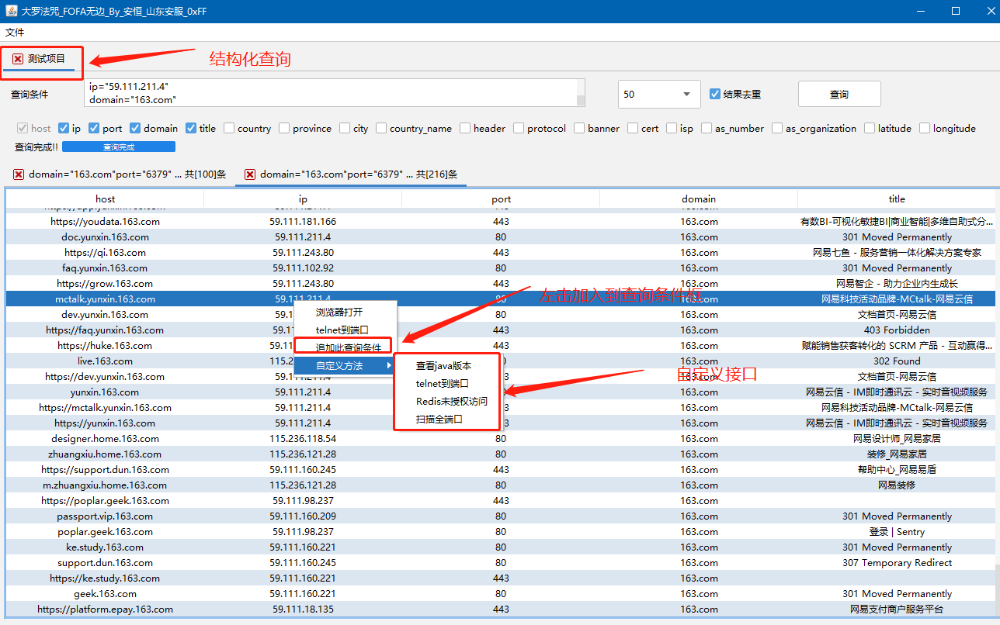

# 大罗法咒_fofa无边
## 变更说明:
# **还是没有导出,可以将结果全选, Ctrl+C 打开一个excel 然后Ctrl+V**
## 2022-5-21
最新版本:https://github.com/naozibuhao/fofatools/releases/tag/V2.6

1.取消了功能用的少的按钮

2.调整了功能位置

3.添加了 一键oneforall 一键 dismap, 一键xray,一键vulmap,一键mongodb,一键redis,一键crawlergo , 其实这些东西都可以自己添加

4. 现在估计是fofa 修改查询策略, 如果 5000条, 或者10000条, 查不出东西来的话, 可以修改为每个查询条件1000条, 添加多个查询条件, 一般是能出来结果的

5. 其他没啥了

==========================================================================================

# **没有导出!没有导出!!没有导出!!!**

如果需要导出数据,可以在表格中全选,Ctrl+C,打开一个EXCEL,然后Ctrl+V

导出功能作者认为没必要

## 变更说明

## 2021-7-3 

1.为了照顾触摸板患者,贴心加入添加快捷键

Ctrl+N,快速创建项目

左右切换项目标签(需要在项目标签中双击后获取焦点才能使用左右按钮)


2021-7-2 

## 2021-7-2 

1.更名为大罗法咒V2.0

2.项目化查询,对于同一个查询内容放在同一个tab页

3.添加自定义接口

4.鼠标右击表格内容,增加添加此查询条件

5.还是没有导出



### 2021-6-18

       	1. 添加批量查询及进度条,条件输入框不再支持回车事件,请点击查询按钮
       	2. 取消大威天龙音乐播放
       	3. 调整查询条件"协议"默认为勾选,并调整位置
       	4. 修改全端口扫描线程数为800
       	5. 修改了一些BUG的
       	6. 仍然没有导出按钮

### 2021-5-29  V1.2


1. 修改UI样式,相同视觉范围内显示更多信息
2. 搜索条件输入框中响应回车键,输入完以后直接回车获得结果
3. 添加TAB页签关闭按钮
4. 表格隔行显色
5. 配置文件自定义返回表头
6. 修改右击使用默认浏览器打开,改为右击菜单
7. 添加一键telnet对方端口,省去打开命令行操作
8. 添加一键redis未授权访问,省去打开命令行操作
9. 使用Super-portScan进行全端口扫描
10. 添加1个彩蛋

### 目录结构如下

E:.<br>
│  config.properties -------------------配置文件<br>
│  dwtl.wav<br>
│  fofa_bate.jar      -------------------启动主程序<br>
│  Super-PortScan.py -----------------端口扫描<br>
│<br>
├─fofa_lib                 -------------------依赖包<br>
│      fastjson-1.2.62.jar<br>
│      flatlaf-1.0-rc1.jar<br>
│      fofa-core-1.0.2.RELEASE.jar<br>
│      jackson-annotations-2.9.10.jar<br>
│      jackson-core-2.9.9.jar<br>
│      jackson-databind-2.9.10.4.jar<br>
│<br>
└─tmp------------------------------临时文件夹,可以不用,但不能没有<br>


## 整体效果如下


### 启动过程

过程如下,启动后4秒打开主界面


### 回车响应


### 右击浏览器打开


### 右击telnet端口


### 右击扫描全端口


### 右击redis未授权访问


### 自定义表格头

支持表格头如下:

```
ip,port,domain,title,country,province,city,country_name,header,protocol,banner,cert,isp,as_number,as_organization,latitude,longitude
```

1. 表格头之间使用","间隔调整配置文件中表头顺序即可调整在GUI中显示的顺序
2. 表格头后面添加:1 在大威天龙中将默认被选中,否则默认不选中


### 结果数量及关闭按钮


## 配置文件说明

```
email=邮箱
key=key
#选择排序要显示的列, 列名:int[1/0] title:1 表示title这一列默认选中 0 或者啥也没有表示非默认选中 
#不要填写host 已经默认添加了,你多加也没用 
fields=ip:1,port:1,domain:1,title:1,country,province,city,country_name,header,protocol,banner,cert,isp,as_number,as_organization,latitude,longitude
#fields=host,title,ip,domain,port,country
# python3位置,如果设置了环境变量,可直接填写python3 即可为端口扫描做准备
pythonpath=python38
#临时文件夹,用于存放window系统所有的命令,及所有系统下所有全端口扫描结果HTML文件
tmp=tmp
# 测试redis未授权访问 值为redis-cli的环境变量,或者redis-cli的物理路径
redis=redis-cli
# 为以后直接awvs做准备
awvsurl=1
awvskey=1
```

# 再说一遍,没有导出!没有导出!!没有导出!!!

如果需要导出数据,可以在表格中全选,Ctrl+C,打开一个EXCEL,然后Ctrl+V

导出功能作者认为没必要
